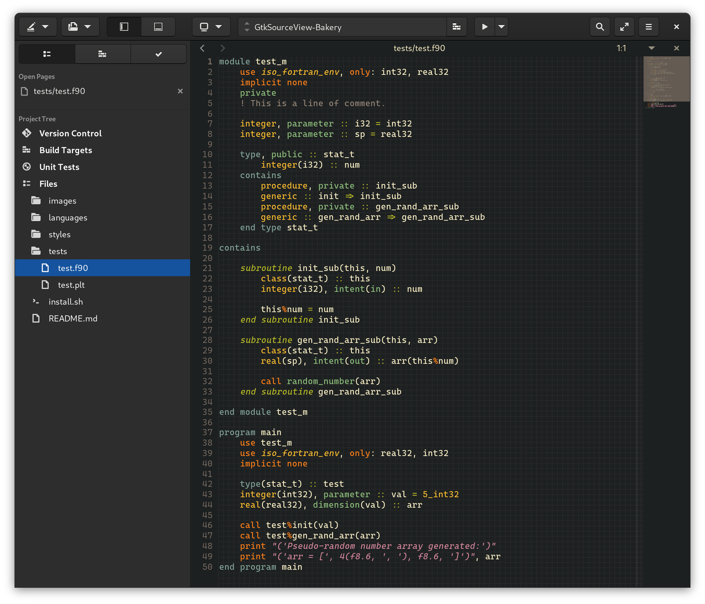
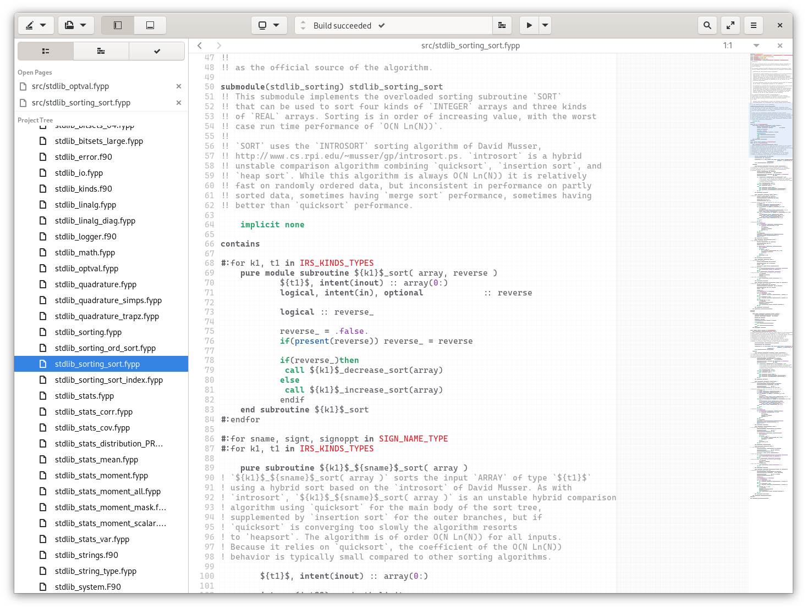

# GtkSourceView-Bakery

This repository includes some self-cooked GtkSourceView syntax highlighting scripts (`.lang` files) and themes (`.xml` files). Feel free to grab a piece of cake! (`.ncl` and `.plt` are soon to be supported!)

## Some screenshots

Something you might be interested in this screenshot:)

* IDE: Gnome Builder (of course)
* Font: [Cascadia Code](https://github.com/microsoft/cascadia-code)

Syntax Highlight for modern Fortran

Syntax Highlight for `.fypp` file ([fypp](https://github.com/aradi/fypp))

