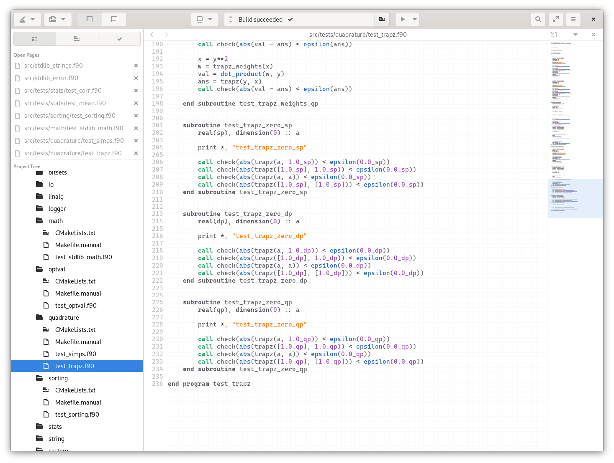

# GtkSourceView-Bakery

This repository includes some self-cooked GtkSourceView syntax highlighting scripts (`.lang` files) and themes (`.xml` files). Feel free to grab a piece of cake!

## Some screenshots

Something you might be interested in this screenshot:)

* IDE: Gnome Builder (of course)
* Font: [Cascadia Code](https://github.com/microsoft/cascadia-code)

